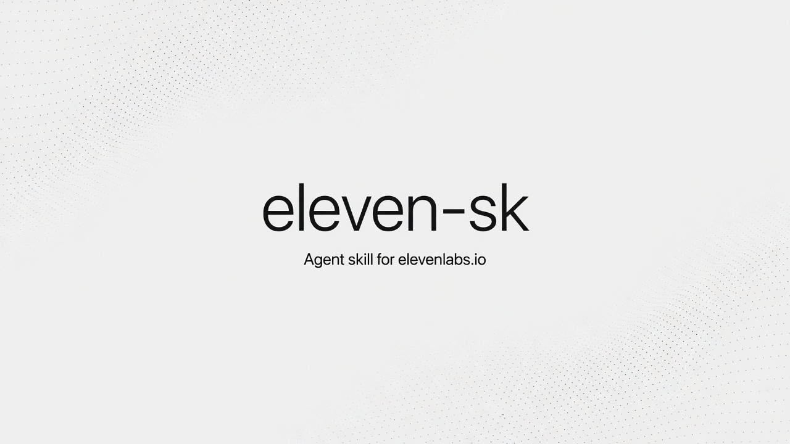

# eleven-sk

[](https://github.com/adriendidoudid/eleven-sk/actions/workflows/validate.yml)
[](LICENSE)

Agent skill for **ElevenLabs' API**, written against the open [Agent Skills](https://agentskills.io) standard (`SKILL.md`) — it works with **any coding agent that reads skills**: Claude Code, Cursor, Codex, Gemini CLI, opencode, Amp, and others. The instructions are agent-agnostic (plain `curl` + `jq`, no harness-specific tools assumed). Once installed, your agent can autonomously:

| Capability | Endpoint | Notes |
|---|---|---|
| 🗣️ Text to speech | `/v1/text-to-speech/{voice_id}` (+ `/with-timestamps`, `/stream`) | `eleven_multilingual_v2` |
| 🎭 Text to dialogue | `/v1/text-to-dialogue` | multi-speaker, `eleven_v3` |
| 📝 Speech to text | `/v1/speech-to-text` | audio/video, diarization, YouTube/TikTok URLs |
| 💥 Sound effects | `/v1/sound-generation` | 0.5–30s |
| 🎵 Music | `/v1/music` (+ `/detailed`, `/video-to-music`, `/stem-separation`) | `music_v1`/`music_v2` |
| 🔄 Voice changer | `/v1/speech-to-speech/{voice_id}` | preserves emotion/timing |
| 🧬 Voice design & cloning | `/v1/text-to-voice/*`, `/v1/voices/add`, `/v1/voices/pvc/*` | design, remix, instant + professional cloning |
| 🔇 Audio isolation | `/v1/audio-isolation` | background noise removal |
| 🌍 Dubbing | `/v1/dubbing` (async) | translate a video/audio file, preserving voice |
| ⏱️ Forced alignment | `/v1/forced-alignment` | timestamp an existing transcript |
| 📖 Pronunciation dictionaries | `/v1/pronunciation-dictionaries/*` | fix mispronunciations |

**No text-to-image or text-to-video generation** — ElevenLabs' public API doesn't offer either (that only exists in the closed ElevenCreative web app / an enterprise-gated Studio API). The skill says so explicitly instead of guessing an endpoint; see [`skills/elevenlabs/SKILL.md`](skills/elevenlabs/SKILL.md) for details, and use the two capabilities that touch existing video (Dubbing, Video-to-Music) — both treated as long-running/background jobs.

Pure `curl` — no SDK, no dependencies to install in your projects. The skill lives in [`skills/elevenlabs/SKILL.md`](skills/elevenlabs/SKILL.md).

## Requirements

- An ElevenLabs API key from [elevenlabs.io/app/settings/api-keys](https://elevenlabs.io/app/settings/api-keys)
- `curl`, `jq`, and `python3` available in the shell (`python3` is only needed for the multipart/mixed response from `/v1/music/detailed`)

Export the key (add it to `~/.bashrc` / `~/.zshrc` to make it permanent):

```bash
export ELEVENLABS_API_KEY="..."
```

(`ELEVEN_API_KEY` works as a fallback.)

## Install

```bash
npx skills add adriendidoudid/eleven-sk
```

The installer asks **which agent(s)** to install into (Claude Code, Cursor, Codex, Gemini CLI, opencode, Amp…) and handles each one's skills directory for you. Choose the **global** install so the skill is available in every project. To update later, re-run the same command.

Manual fallback — copy the skill into your agent's skills folder (Claude Code shown; other agents each have their own equivalent directory):

```bash
git clone https://github.com/adriendidoudid/eleven-sk
mkdir -p ~/.claude/skills/elevenlabs
cp eleven-sk/skills/elevenlabs/SKILL.md ~/.claude/skills/elevenlabs/SKILL.md
```

## Usage

Once installed, just ask naturally in any project — the agent picks up the skill on its own. Real-world prompts:

**Voiceover / narration:**

> Generate a voiceover for this landing page's hero text using ElevenLabs, warm and confident tone, and save it as `public/audio/hero.mp3`.

**Sound effect:**

> Generate a 3-second "sword unsheathing" sound effect with ElevenLabs for the game's UI.

**Music:**

> Compose a 30-second upbeat lo-fi background track with ElevenLabs for this app's loading screen.

**Transcription:**

> Transcribe this interview recording with ElevenLabs, with speaker labels, and give me a clean text summary per speaker.

**Voice design:**

> Design a calm, older female narrator voice with ElevenLabs, generate a couple of previews, and use the best one for the audiobook intro.

**Voice cloning:**

> Clone my voice from `samples/me-1.mp3` and `samples/me-2.mp3` with ElevenLabs so I can use it for future narration.

**Dubbing (translate a video):**

> Dub `demo.mp4` into Spanish with ElevenLabs and save the result — this can take a few minutes, so treat it as background work and let me know when it's ready.

**Voice changer:**

> Take this scratch VO take and re-voice it with ElevenLabs voice X, keeping the same delivery and timing.

Prompts work in any language — the skill's triggers are semantic.

## Publishing & CI

`npx skills add` installs straight from this repo's default branch — **every push to `main` is immediately live** for new installs; there is no separate publish step. To protect that, CI runs on every push and PR:

- `scripts/validate.py` — frontmatter, bash syntax of every snippet, JSON validity of every payload
- `scripts/test-jq.sh` — every `jq` extraction tested against mock ElevenLabs API responses (including error shapes and the dubbing poll loop)

An optional `live-smoke` job (manual trigger, needs an `ELEVENLABS_API_KEY` repo secret) pings the real models endpoint.

Run the same checks locally before pushing:

```bash
python3 scripts/validate.py && bash scripts/test-jq.sh
```

## Repository layout

```
skills/elevenlabs/SKILL.md   the skill (the only thing npx skills add installs)
scripts/validate.py          static validation (frontmatter, bash, JSON)
scripts/test-jq.sh           jq expressions vs mock API responses
.github/workflows/           CI: validate on push/PR + optional live smoke test
```

## Cost & quota notes

Pricing is credit-based and changes over time — check [elevenlabs.io/pricing](https://elevenlabs.io/pricing) for current rates. The skill includes a quota-check call (`GET /v1/user/subscription`) to read remaining characters/credits before large jobs.

## License

[MIT](LICENSE)
